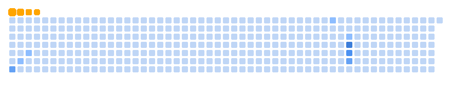

<h3 align="center">🌐 Visit My Portfolio</h3>

  

<h1 align="center">⚔️ INFEXJAY ⚔️</h1>
<h3 align="center">💀 From Underground Hacker to Full-Stack Architect 🚀</h3>

  

  <b><i>Now I don’t just hack systems. I design empires. 👑</i></b>

  

---

<h2 align="center">🚀 Who TF Is Infexjay?</h2>

<table align="center">
<tr><td><strong>Name:</strong></td><td>Infexjay</td></tr>
<tr><td><strong>Role:</strong></td><td>Full-Stack Developer / AI Engineer / Ex-Hacker</td></tr>
<tr><td><strong>Location:</strong></td><td>Nigeria 🇳🇬</td></tr>
<tr><td><strong>Stack:</strong></td><td>MERN, Laravel, Tailwind, Firebase, Python, Kotlin, Java</td></tr>
<tr><td><strong>Specialties:</strong></td><td>Mobile Apps, AI Agents, Security Tools, Game Boosting</td></tr>
<tr><td><strong>Projects:</strong></td><td>BoomFare, Game Booster, AI Face ID, VulnScanX</td></tr>
</table>

---

<h2 align="center">🧠 Projects That Hit HARD</h2>

💬 <b>BoomFare Messenger:</b> Encrypted chat app for the 🇳🇬 street  
🎮 <b>Infex Game Booster:</b> Auto GFX tweaker for high FPS gains  
🔓 <b>AI Face ID:</b> Face unlock w/ iPhone-style animation  
🛡️ <b>VulnScanX:</b> Port scanner + vuln detector  
🧙 <b>SilentReaper:</b> External Free Fire Max mod  
📹 <b>Stray Dog:</b> CCTV terminal app with 10-sec counter  

---

<h2 align="center">🧰 Skill Arsenal</h2>

  

---

<h2 align="center">📊 GitHub Metrics</h2>

  
   
  
   
  

---

<h2 align="center">🏆 Trophies</h2>

  

---

<h2 align="center">⚙️ Setup & Stack</h2>

💻 <b>PC:</b> Lenovo ThinkPad W530 (NVIDIA K2000M)  
🧪 <b>Tools:</b> Termux, VS Code, Firebase, Android Studio, Groq Cloud, MSYS2  
🧠 <b>AI Assistants:</b> Codeium, Continue.dev, CodeWhisperer, OpenAI (👋)  

---

<h2 align="center">🌐 Connect With Me</h2>

  
  
  

---

<h2 align="center">🐍 Contribution Snake 🐍</h2>

  <picture>
    <source media="(prefers-color-scheme: dark)" srcset="dist/github-snake-dark.svg" />
    <source media="(prefers-color-scheme: light)" srcset="dist/github-snake.svg" />
    
  </picture>

  

---

<h2 align="center">📈 Contribution Heatmap</h2>

  

---

<h2 align="center">🎮 Profile Game 🎮</h2>

  <i>Coming soon... stay tuned for some interactive fun!</i>

---

<h2 align="center">👁 Profile Views</h2>

  

---

<h3 align="center">🗡️ From Hack to Stack. I Build. I Deploy. I Dominate. 🗡️</h3>
